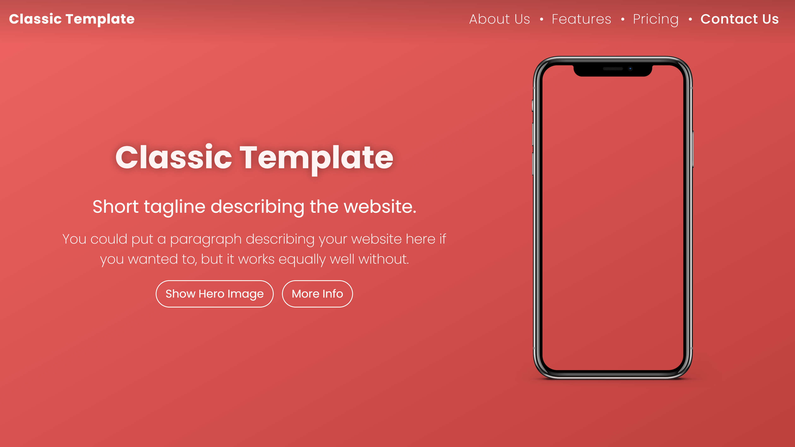
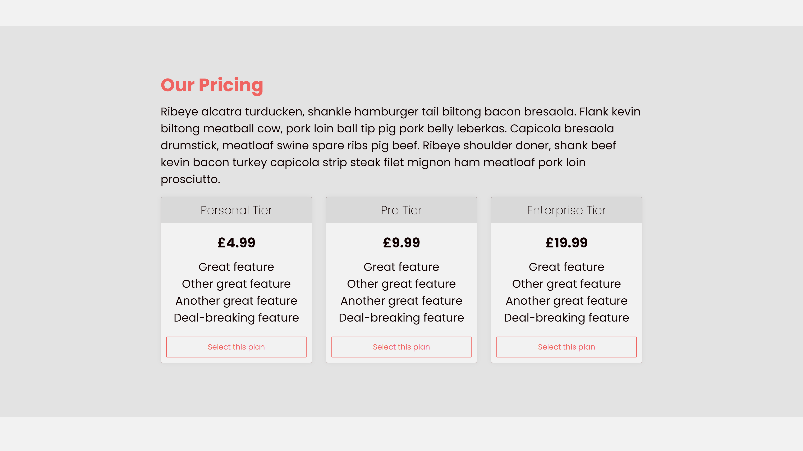
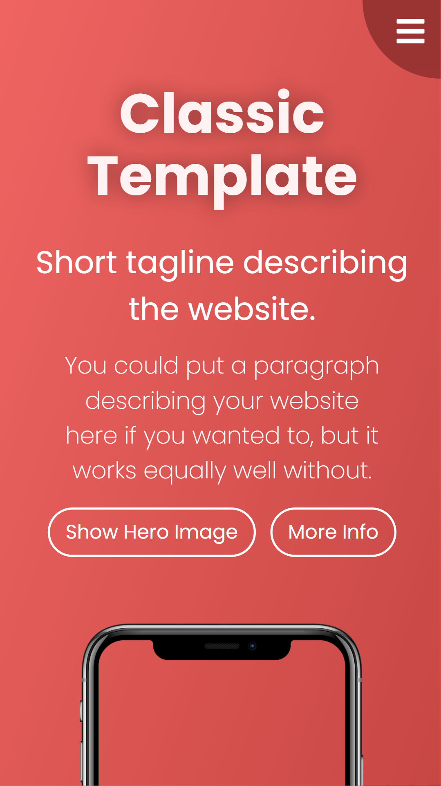
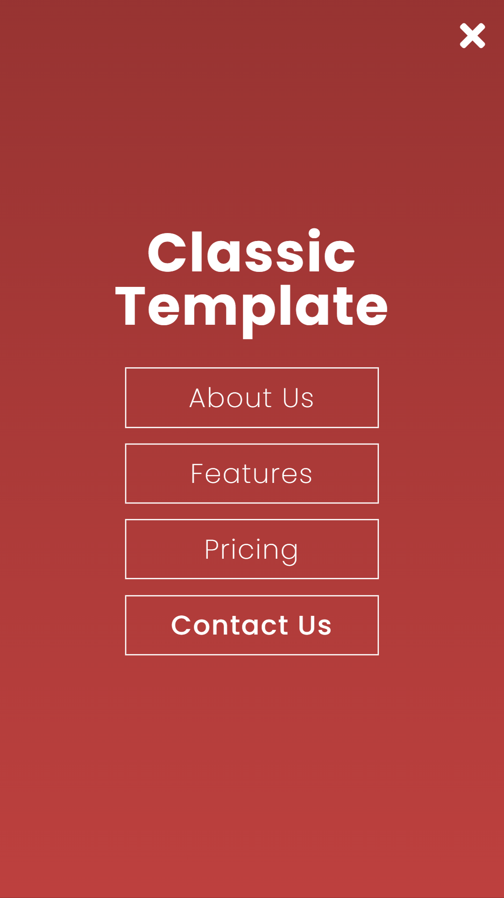
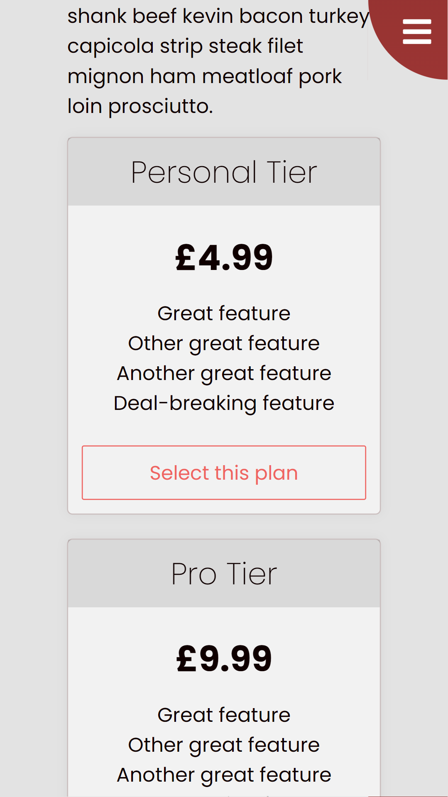

# William Henderson's Web Templates

This repository contains a selection of website templates I've made, some to practice design and CSS, and others for usage in my own projects. Feel free to use any of them, but only for non-commercial purposes and make sure to attribute me. All of the templates are mobile friendly and fully customisable.

## Classic

The classic template is my favourite, and I've used it in several of my own projects, such as [TidesX](https://tidesx.ga) and [my portfolio](https://w-henderson.github.io). It features a bold hero section with an optional image, a mobile-friendly navigation bar which becomes full-screen if the orientation is portrait, simple content sections, and a pricing section inspired by [that of Bootstrap](https://getbootstrap.com/docs/4.0/examples/pricing).

| Hero section | Pricing section |
| --- | --- |
|  |  |

| Mobile hero section | Mobile navigation | Mobile pricing |
| --- | --- | --- |
|  |  |  |